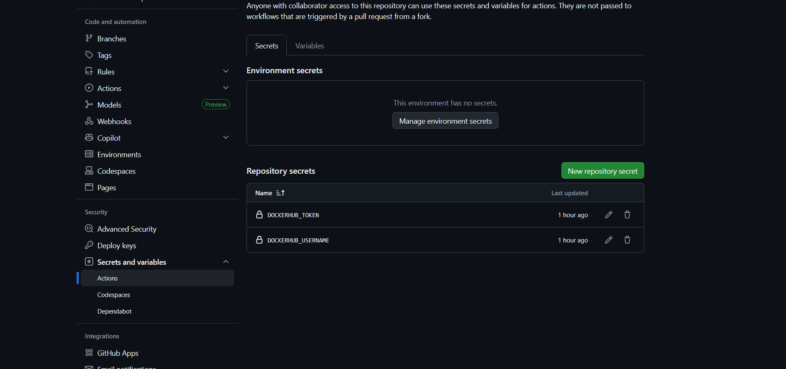
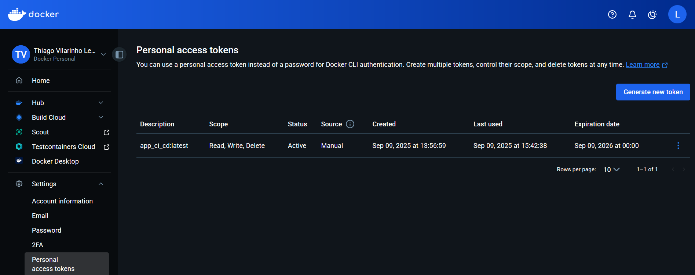
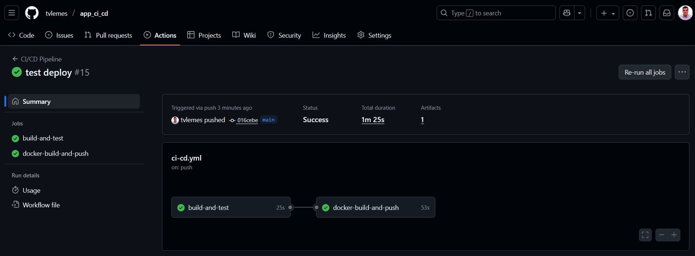

# Tutorial CI/CD

# 🚀 Streamlit + Docker + CI/CD

Este projeto é um exemplo completo de aplicação **Streamlit** containerizada com **Docker** e integrada com **CI/CD no GitHub Actions** e com **Docker Hub**.  
Permitindo rodar localmente via **Docker Compose**.

---

## 📂 Estrutura do Projeto

app_ci_cd/ \
│── app.py # Código principal do Streamlit\
│── requirements.txt # Dependências da aplicação\
│── Dockerfile # Receita para build da imagem Docker\
│── docker-compose.yml # Orquestração local da aplicação\
│── pipeline.bat # Script para rodar pipeline no Windows\
│── tests/\
│ └── test_app.py # Teste unitário simples para validar o app\
│── .github/\
│ └── workflows/\
│ └── ci-cd.yml # Pipeline CI/CD do GitHub Actions\

**OBS:** o arquivo ci-cd.yml contém as configurações o Docker hub.

---

## ⚙️ Funcionalidade dos Arquivos

- **app.py** → Código da aplicação Streamlit.  
- **requirements.txt** → Lista de bibliotecas necessárias.  
- **Dockerfile** → Cria a imagem Docker da aplicação.  
- **docker-compose.yml** → Define como rodar a aplicação em containers.  
- **pipeline.bat** → Script para rodar comandos no Windows (substitui Makefile).  
- **tests/test_app.py** → Teste que garante que `app.py` importa sem erros.  
- **.github/workflows/ci-cd.yml** → Workflow CI/CD que:
  1. Roda testes automáticos.
  2. Faz build e push da imagem para o Docker Hub.
  3. Faz deploy no Docker Compose.

---

## 🖥️ Rodando Localmente (Windows)

### 🔹 1. Rodar testes
```pipeline.bat test```

### 🔹 2. Build da imagem Docker
```pipeline.bat build```

### 🔹 3. Subir aplicação com Docker Compose
```pipeline.bat up```

### 🔹 4. Ver logs do container
```pipeline.bat logs```

### 🔹 5. Derrubar containers
```pipeline.bat down```

## ☁️ CI/CD no GitHub Actions

O pipeline ci-cd.yml roda automaticamente quando há push na branch main.
Ele executa três etapas principais:

build-and-test → Roda testes automáticos (pytest).

docker-build-and-push → Cria e envia a imagem para o Docker Hub.


---

## 🔑 Secrets Necessários no GitHub

No repositório, vá em:

**Settings > Secrets and variables > Actions > New repository secret**

Adicione:

**DOCKERHUB_USERNAME** → Usuário do Docker Hub

**DOCKERHUB_TOKEN** → Token de acesso do Docker Hub



Capturando o Token Docker Hub:


---

## ⚙️ Para rodar o Makefile localmente (Windows)
Para rodar o arquivo **makefile** localmente no prompt é necessário instalar o **make** com o **choco**. Segue abaixo o comando para executar a instalação, mas para isso o **choco** deve estar instalado.

```choco install make```

**Rodando o "Pipeline Local"**

- Rodar testes

```make test```

- Build da imagem

```make build```

- Subir app com Docker Compose

```make up```

- Ver logs

```make logs```

- Derrubar containers

```make down```

## ▶️ Rodando o Projeto

Para rodar o projeto basta fazer o **git push** para o Github, a seguir como visualizar o andamento do projeto.



## 👨‍💻 Sobre

Autor: Thiago Vilarinho Lemes <br>
LinkedIn <a href="https://www.linkedin.com/in/thiago-v-lemes-b1232727" target="_blank">Thiago Lemes</a><br>
e-mail: contatothiagolemes@gmail.com | lemes_vilarinho@yahoo.com.br
